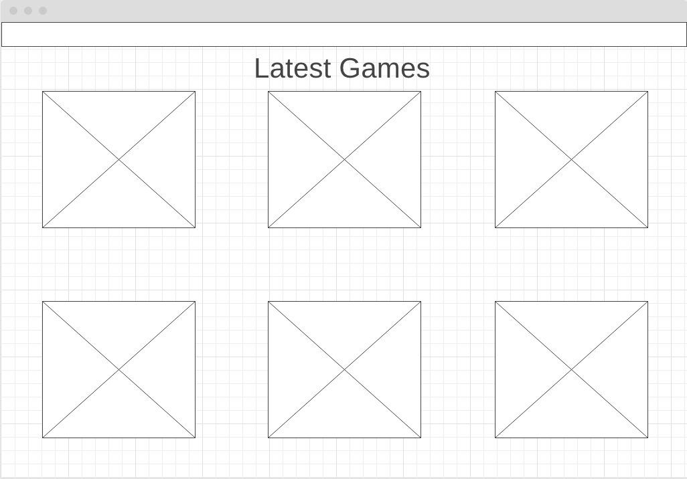

# Gamium

A gaming website for Indie Game Creators to share their games with the world and receive reviews and rankings.
Users will be able to share their games and/or leave reviews on games.

# Challenges

- Building the backend 
- Auth. 

# Mvp
A site that shows a list of games with clickable links to those games. 
The Links contain images and info on the game the user selected.
## Backend

Table for users, games and reviews.

## Users

- Create a register/login page. Profile page for users.
- Upload screen for games.
- (post)Rate other users games.

## Lander Page

Loads the most recent games or top rated games

## Other Pages

View all games. View user's profiles.

# Post Mvp

Ranking and rating games.

# Features

Shareable content to share with the world to test out Indie Games.
Allows game designers to get feedback on their projects from other game designers.
Introduces users to games they might not otherwise find.

# ERD

# Backend API Endpoints
N/A
# Wireframes

# Component Heirarchy
- Nav
- Login/Register
- GameList
  - SingleGame
    - ReviewGame
- AddGame
- Footer
